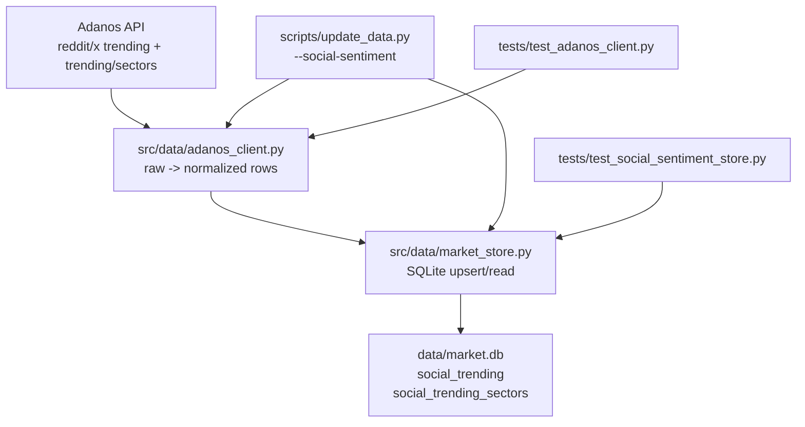
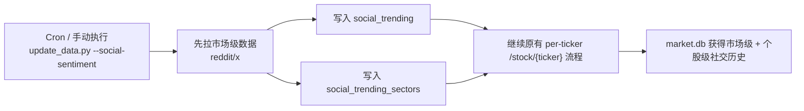

# Adanos Market Social Phase A Implementation Plan

> **For Claude:** REQUIRED SUB-SKILL: Use superpowers:executing-plans to implement this plan task-by-task.

**Confidence: 92%**
**不确定点**: `trending/sectors` 是否永远返回固定 sector 集；为避免残留，写入路径按全量替换设计。

**Goal:** 为 Adanos 市场级稳定 endpoint 落地历史时序存储，新增 `social_trending` 与 `social_trending_sectors` 两张表，并接入 `--social-sentiment` 采集流程。

**Tech Stack:** Python 3.10+, SQLite, requests, pytest

---

## Architecture（架构图）

> 一句话解释：客户端负责字段归一化，store 负责全量替换落库，更新脚本负责调度，测试覆盖真实 payload 形状与写入语义。

## Business Flow（业务流程图）

> 一句话解释：市场级采集插在原有个股社交采集前面，失败隔离，不阻断后续 per-ticker 数据更新。

## Alternatives Considered（替代方案）

| 方案 | 优势 | 劣势 | 选择理由 |
|------|------|------|----------|
| A. Phase A 只接 `trending` + `trending/sectors`（推荐） | 文档成熟、字段稳定、实现小步验证 | `market_sentiment` 价值延后 | 先把稳接口落地，降低新 endpoint 抖动风险 |
| B. 三个 endpoint 一次性全接 | 一次完成市场级能力 | `market_sentiment` 刚发布，schema 风险更高 | 不选，违反小步验证原则 |
| C. 不建新表，只在晨报临时 live fetch | 改动最小 | 无历史时序、无法回测、无法同步云端历史 | 不选，丢失数据资产 |

## Risks & Mitigation（风险自证）

- **最大风险:** API 返回结果集会缩小或字段缺失，导致旧排行/旧 sector 残留或 schema 假设失真。
- **为什么不用更简单的做法:** 直接 `INSERT OR REPLACE` 只适合键稳定集合；排行榜和 sector 集都可能变化，必须按 `(date, source)` 全量替换。
- **回滚方案:** 代码层可回滚到当前 `--social-sentiment` 行为；数据层新增表独立，不影响现有 `social_sentiment` 读取逻辑。

## Acceptance Criteria（验收标准）

- [ ] `social_trending` 与 `social_trending_sectors` 在本地 `market.db` 自动创建成功
- [ ] `update_data.py --social-sentiment` 会先写市场级数据，再继续原有 per-ticker 采集
- [ ] 任一 source/endpoint 失败时，其它 source/endpoint 与 per-ticker 采集仍继续执行
- [ ] 同一 `(date, source)` 重跑后不会残留旧 rank 或旧 sector
- [ ] 测试覆盖真实 payload 字段映射、UTC 日期写入、JSON 序列化与全量替换策略

---

## Implementation Notes

- `date` 一律使用 UTC `YYYY-MM-DD`
- `created_at` 一律使用 UTC ISO8601
- 两张新表都保留 `period_days`
- `social_trending` 和 `social_trending_sectors` 都按 `(date, source)` 先删后写
- 真实 API 样本表明：
  - `trending` 返回 `mentions`, `trend_history`, `unique_posts`/`unique_tweets`, `is_validated`
  - `trending/sectors` 返回 `sector`, `mentions`, `unique_tickers`, `top_tickers`, `unique_authors`（X only）

## Checklist

- [x] 抓取真实 payload 样本，确定 fixture 形状
- [x] 写 plan 文件并开始执行
- [x] 更新 `src/data/adanos_client.py`
- [x] 更新 `src/data/market_store.py`
- [x] 更新 `scripts/update_data.py`
- [x] 更新 `config/settings.py`
- [x] 更新 `tests/test_adanos_client.py`
- [x] 更新 `tests/test_social_sentiment_store.py`
- [x] 运行针对性测试
- [x] 运行一次 `update_data.py --social-sentiment` 做端到端验证

## Task 1: Capture Real Payload Shapes

**Files:**
- Modify: `tests/test_adanos_client.py`

- [ ] 记录 Reddit/X `trending` 与 `trending/sectors` 的真实字段形状
- [ ] 基于真实字段写 fixture，避免只依赖文档猜字段

## Task 2: Extend Adanos Client

**Files:**
- Modify: `src/data/adanos_client.py`
- Test: `tests/test_adanos_client.py`

- [ ] 吸收当前未提交的字段修补：`mentions` / `sentiment_score`
- [ ] 新增 `get_trending_rows(source, days, limit)`
- [ ] 新增 `get_trending_sectors(source, days, limit)`
- [ ] 新增 `get_trending_sectors_rows(source, days, limit)`
- [ ] 统一做 UTC `date` / `created_at`
- [ ] 统一序列化 `trend_history` / `top_tickers`

## Task 3: Extend Market Store

**Files:**
- Modify: `src/data/market_store.py`
- Test: `tests/test_social_sentiment_store.py`

- [ ] 在 `_SCHEMA` 新增两张表及索引
- [ ] 在 `_VALID_TABLES` 新增两个表名
- [ ] 新增 `upsert_social_trending(date, source, rows)`
- [ ] 新增 `upsert_social_trending_sectors(date, source, rows)`
- [ ] 新增 `get_social_trending(date, source)`
- [ ] 新增 `get_social_trending_sectors(date, source)`

## Task 4: Extend Update Pipeline

**Files:**
- Modify: `scripts/update_data.py`
- Modify: `config/settings.py`

- [ ] 新增 `ADANOS_TRENDING_LIMIT = 20`
- [ ] 在 `--social-sentiment` 中先跑市场级采集
- [ ] 每个 source/endpoint 独立 `try/except`
- [ ] 保持原有 per-ticker 流程不变

## Task 5: Verification

**Files:**
- Modify: `tests/test_adanos_client.py`
- Modify: `tests/test_social_sentiment_store.py`

- [ ] 跑 `PYTHONPATH=. /Users/owen/CC\ workspace/Finance/.venv/bin/pytest tests/test_adanos_client.py tests/test_social_sentiment_store.py -q`
- [ ] 跑 `PYTHONPATH=. /Users/owen/CC\ workspace/Finance/.venv/bin/python scripts/update_data.py --social-sentiment`
- [ ] 用 `sqlite3 data/market.db` 查两张新表的写入结果
