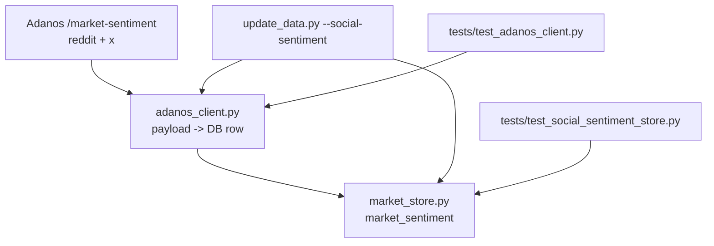
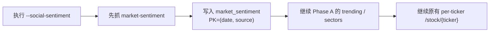

# Adanos Market Social Phase B Implementation Plan

> **For Claude:** REQUIRED SUB-SKILL: Use superpowers:executing-plans to implement this plan task-by-task.

**Confidence: 95%**
**不确定点**: 无关键不确定点；真实 Reddit/X payload 已确认。

**Goal:** 接入 Adanos `market-sentiment`，新增 `market_sentiment` 表并接入 `--social-sentiment` 流程，保留完整数值字段与 `raw_json` 兜底。

**Tech Stack:** Python 3.10+, SQLite, requests, pytest

---

## Architecture（架构图）

> 一句话解释：Phase B 只新增一个日频快照表，不改动 Phase A 已完成的排行/sector 表。

## Business Flow（业务流程图）

> 一句话解释：market-sentiment 是最上层聚合快照，插在市场级采集最前面。

## Alternatives Considered（替代方案）

| 方案 | 优势 | 劣势 | 选择理由 |
|------|------|------|----------|
| A. 完整数值字段 + `raw_json`（推荐） | 不丢 alpha，后续分析灵活 | schema 稍大 | endpoint 刚发布，保留足够信息最稳 |
| B. 只存 4 个核心字段 | 改动最小 | breadth/activity/counts 永久丢失 | 不选，历史快照不可回填 |
| C. 只存 `raw_json` | 最抗 schema 变化 | SQL 查询和晨报消费不方便 | 不选，牺牲可用性 |

## Risks & Mitigation（风险自证）

- **最大风险:** 新 endpoint 字段后续微调导致 schema 假设错位。
- **为什么不用更简单的做法:** 只存 4 字段会永久丢掉 `active_tickers` / counts / source-specific breadth，代价比多几列更高。
- **回滚方案:** `market_sentiment` 独立成表；移除 Phase B 代码不会影响 Phase A 与原有个股社交逻辑。

## Acceptance Criteria（验收标准）

- [ ] `market_sentiment` 表自动创建成功
- [ ] Reddit/X `market-sentiment` 每源每天各写 1 行
- [ ] 保留 `mentions`、`active_tickers`、sentiment counts、`trend_history`、`drivers`、source-specific 字段和 `raw_json`
- [ ] 测试覆盖 Reddit/X 字段映射、UTC 日期、`raw_json` 存储、冲突覆盖
- [ ] 小范围实跑后能在 sqlite 中查到 2 行当天快照

## Phase B Payload Snapshot

- Reddit: `buzz_score`, `trend`, `mentions`, `unique_posts`, `subreddit_count`, `total_upvotes`, `active_tickers`, `sentiment_score`, `positive_count`, `negative_count`, `neutral_count`, `bullish_pct`, `bearish_pct`, `trend_history`, `drivers`
- X: `buzz_score`, `trend`, `mentions`, `unique_tweets`, `unique_authors`, `total_upvotes`, `active_tickers`, `sentiment_score`, `positive_count`, `negative_count`, `neutral_count`, `bullish_pct`, `bearish_pct`, `trend_history`, `drivers`

## Checklist

- [x] 更新 `src/data/adanos_client.py`
- [x] 更新 `src/data/market_store.py`
- [x] 更新 `scripts/update_data.py`
- [x] 更新 `tests/test_adanos_client.py`
- [x] 更新 `tests/test_social_sentiment_store.py`
- [x] 跑 targeted pytest
- [x] 做一次小范围实跑验证
