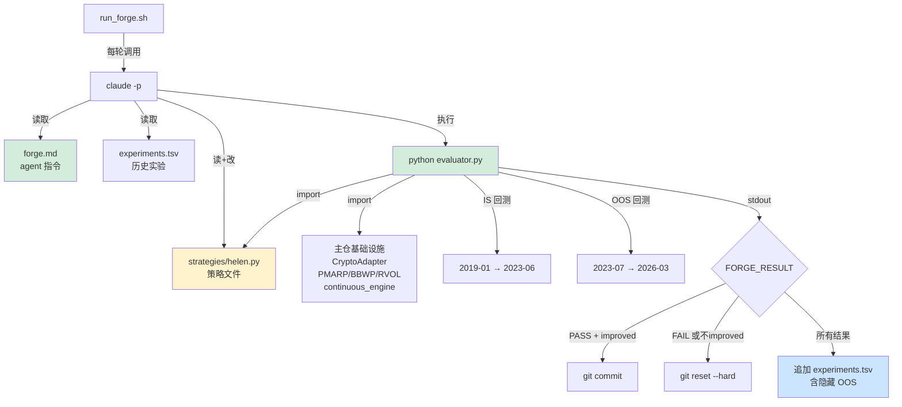

# Forge — 策略自动锻造系统设计文档

> **设计日期**: 2026-03-26
> **状态**: 设计完成，待实现
> **依赖**: Helen v2.0 (dual-engine BTC timing), autoresearch pattern (Karpathy)
> **MVP 标的**: Helen (BTC 择时)，架构通用

---

## 前因：为什么需要 Forge

### 从 Helen v1.0 到 v2.0 的启示

Helen（极简双引擎 BTC 择时系统）的优化过程是这样的：

1. Boss 提供完整的主观交易系统（v1.0 法典）
2. CC 做代码实现 + 回测
3. 发现日线数据缺失导致右侧引擎 6 年瘫痪（数据 bug）
4. 修复后发现风控模块是纯负收益（-5.4%/年 CAGR，MDD 仅改善 0.6%）
5. 发现交接棒（PMARP>50%）过早清仓，左侧平均只持有 3.3 天
6. 三刀优化：砍风控 + 贪婪映射 + 自然交接棒
7. 结果：CAGR 42.6% → 48.7%（vs B&H 50.4%），MDD -46.9% → -45.8%

**这个过程花了一整个会话的人工诊断和实验。** 每一步都是：假设 → 改代码 → 跑回测 → 看数据 → 新假设。这正是 autoresearch 模式能自动化的事。

### Autoresearch 的核心洞察

Karpathy 的 autoresearch 用三个文件实现了 LLM 训练的自动化实验：
- `prepare.py`（不可改）— 数据 + 评估函数
- `train.py`（可改）— 训练代码，agent 唯一可修改的文件
- `program.md`（指令）— agent 的约束规则

棘轮循环：改代码 → 跑实验 → 好就 commit，差就 reset → 循环。一晚上 ~100 个实验。

### 直接用 autoresearch 的问题

1. **过拟合**：LLM 训练 5 分钟不会过拟合，但策略优化 100 轮几乎必然拟合到历史噪声
2. **指标设计**：val_bpb 是单一标量，策略有 CAGR/MDD/Exposure 多维度
3. **安全门槛**：LLM 没有"爆仓"风险，策略有

**Forge = autoresearch 模式 + IS/OOS 过拟合防护 + 多维门槛检查**

---

## 系统概览

### 核心循环

```
LOOP (人工启动，自动循环，人工决定何时停):
  1. HYPOTHESIZE — agent 读当前策略 + 最近实验日志，形成假设
  2. MUTATE — 修改策略文件（参数调整 or 结构变更）
  3. EVALUATE — 跑 IS 段回测，提取指标
  4. GATE — MaxDD > -55%? Exposure < 20%? → 直接丢弃
  5. RATCHET — IS CAGR 优于当前最优？→ git commit 保留，否则 git reset
  6. AUDIT — 无论成败，记录到 experiments.tsv（含隐藏的 OOS 指标）
  7. REPEAT
```

### 三文件对应关系

| autoresearch | Forge | 角色 | 可改? |
|---|---|---|---|
| `prepare.py` | `evaluator.py` | 裁判：IS/OOS 分割 + 回测 + 门槛 + 输出 | 不可改 |
| `train.py` | `strategies/helen.py` | 策略：agent 唯一可修改的文件 | **可改** |
| `program.md` | `forge.md` | 指令：约束规则 + 探索方向 + 禁区 | 不可改 |

### 两种优化模式

| 模式 | 描述 | 价值 |
|------|------|------|
| **A. 参数优化** | 调数值（EMA 周期、斜率阈值、hold 天数） | 精细校准，低风险 |
| **B. 策略进化** | 改结构（换指标、改逻辑、加新条件） | 发现人类未想到的改进，高价值 |

Forge 同时支持两者。agent 根据 forge.md 的探索方向自主决定每轮做 A 还是 B。

---

## 过拟合防护

### IS/OOS 固定分割

这是 Forge 与 autoresearch 最大的区别。

```
BTC 4H 数据时间线：

|-- Warmup --|--------- IS（锻造区）---------|---- OOS（验证区）----|
   2017-08       2019-01 ————————> 2023-06    2023-07 ————> 2026-03
   指标预热         agent 可见                     agent 不可见
   不计分           棘轮指标                       人工审计
                    4.5 年                          2.75 年
```

### 规则

1. **棘轮只看 IS 段 CAGR**（通过门槛后）
2. **OOS 段每次都跑，但 agent 看不到结果**——evaluator 输出 `HIDDEN`，真实值只写入 experiments.tsv
3. **人工审计标准**：IS 改善但 OOS 恶化 = 过拟合信号，该停了
4. **分割点写死在 evaluator.py**（不可改文件），agent 无法篡改

### 门槛设定

```
硬门槛（不过直接丢弃，不进入棘轮比较）：
  - IS MaxDD > -55%       # Helen v2.0 当前 -46%，留余量
  - IS Exposure < 20%     # 防止 agent 发现"少做少错"的漏洞

棘轮指标（过门槛后比较）：
  - IS CAGR，越高越好

审计指标（写入 TSV，人工看）：
  - OOS CAGR / OOS MDD / OOS Exposure
  - IS-OOS gap（过拟合程度的直接度量）
```

Exposure 下限的存在意义：没有它，agent 的最优策略是"几乎不交易"，MDD 趋近 0 但 CAGR 也趋近 0，完美通过门槛但毫无价值。

---

## 文件结构

```
Finance/
└── forge/                        # 策略锻造模块
    ├── evaluator.py              # 不可改 — 裁判
    ├── forge.md                  # 不可改 — agent 指令
    ├── strategies/               # 可改 — 策略文件
    │   └── helen.py              # Helen v2.0 独立副本
    ├── experiments.tsv           # 自动生成 — 全部实验日志
    ├── run_forge.sh              # 启动脚本
    └── README.md                 # 使用说明
```

### 关键设计决策

**1. helen.py 是 dual_engine.py 的独立副本，不是 import**

agent 需要能自由修改策略代码。如果 import 主仓模块，改动会影响生产系统。Forge 里的策略文件是"实验室版本"，验证通过后人工决定是否合并回主仓。

**2. evaluator.py import 主仓的基础设施**

数据加载（CryptoAdapter）、指标计算（PMARP/BBWP/RVOL）、回测引擎（continuous_engine）从主仓 import。agent 改策略不影响基础设施。evaluator 是唯一的桥梁。

**3. run_forge.sh 是外壳，不是 agent**

每轮循环是一次独立的 `claude -p` 调用，传入 forge.md 作为 system prompt + 当前策略文件 + 最近实验日志作为上下文。agent 无状态（每轮重新读取），防止累积幻觉。

**4. 通用性**

未来加新策略只需：
1. 在 `strategies/` 下放一个新策略文件
2. 在 evaluator.py 中注册数据源和 IS/OOS 分割点
3. 在 forge.md 中添加该策略的探索方向

框架本身不变。

---

## evaluator.py 输出 Contract

### stdout（agent 可见）

```
FORGE_RESULT:
  status: PASS              # PASS / FAIL_MDD / FAIL_EXPOSURE / ERROR
  is_cagr: 0.4873
  is_mdd: -0.4579
  is_exposure: 0.548
  is_sharpe: 1.21
  is_rebalances: 1285
  oos_cagr: HIDDEN          # agent 看不到
  oos_mdd: HIDDEN
  oos_exposure: HIDDEN
  best_is_cagr: 0.4856      # 当前棘轮基准线
  improved: true             # is_cagr > best_is_cagr
```

### experiments.tsv（含 OOS，供人工审计）

```tsv
timestamp	experiment_id	hypothesis	status	is_cagr	is_mdd	is_exposure	is_sharpe	oos_cagr	oos_mdd	oos_exposure	accepted
```

- `hypothesis`：agent 在本轮的假设描述（从策略注释中提取或由 agent 自行记录）
- `accepted`：true = git commit 保留，false = git reset 丢弃
- OOS 列只在 TSV 中有真实值，stdout 永远是 HIDDEN

---

## forge.md — Agent 指令

```markdown
# Forge — Helen 策略锻造指令

## 你的身份
你是一个量化策略研究员。你的工作是通过修改 strategies/helen.py，
在 IS 段 MaxDD < -55% 且 Exposure > 20% 的约束下，最大化 IS CAGR。

## 工作流程
1. 读 strategies/helen.py 和 experiments.tsv 最近 20 行，理解当前状态
2. 形成一个假设（写成注释："如果我把 X 改成 Y，因为 Z"）
3. 修改 strategies/helen.py
4. 运行 `python evaluator.py`，从 stdout 读取 FORGE_RESULT
5. 如果 status=PASS 且 improved=true → git add + git commit -m "hypothesis"
6. 否则 → git reset --hard HEAD
7. 把结果追加到 experiments.tsv（包含 hypothesis、status、IS 指标、accepted）
8. 回到步骤 1

## 探索方向（优先级从高到低）
1. 右侧引擎的 EMA 周期和斜率阈值
2. 左侧触发条件（PMARP 阈值、BBWP/RVOL 乘数）
3. 左侧退出条件（max hold 天数）
4. 尝试新的指标组合（RSI、MACD、布林带等）
5. 尝试不同的仓位映射函数（sigmoid、阶梯、指数）

## 禁区
- 不要修改数据加载和指标计算的底层代码
- 不要修改 evaluator.py 的输出格式或分割点
- 不要读取或使用 OOS 段的任何信息
- 不要在策略中 hardcode 特定日期或价格
- 不要让策略在特定时间段做特殊处理（日期嗅探 = 过拟合）
- 不要引入外部依赖

## 实验策略
- 每次只改一个变量，隔离因果关系
- 参数调整用小步长（±10-20%），不要跳跃式修改
- 结构性变更前，先用当前参数建立 baseline
- 如果连续 5 次失败，换一个探索方向
- 读 experiments.tsv 的历史，不要重复已经失败的实验
```

---

## 启动流程

### run_forge.sh

```bash
#!/bin/bash
# Forge 策略锻造启动器
# 用法: ./forge/run_forge.sh [--rounds N] [--strategy helen]

FORGE_DIR="$(cd "$(dirname "$0")" && pwd)"
PROJECT_ROOT="$(dirname "$FORGE_DIR")"
STRATEGY="${2:-helen}"
MAX_ROUNDS="${2:-50}"

cd "$FORGE_DIR"

# 初始化 git（如果不在 git 中）
if [ ! -d .git ]; then
    git init
    git add -A
    git commit -m "forge: initial strategy snapshot"
fi

for i in $(seq 1 $MAX_ROUNDS); do
    echo "=== Forge Round $i/$MAX_ROUNDS ==="

    # 调用 claude，传入指令 + 当前状态
    claude -p "$(cat forge.md)

当前策略文件:
$(cat strategies/$STRATEGY.py)

最近实验记录:
$(tail -20 experiments.tsv 2>/dev/null || echo '无历史记录')

当前最优 IS CAGR: $(python evaluator.py --best-only 2>/dev/null || echo 'N/A')

请执行一轮锻造循环。"

    echo "Round $i complete."
done

echo "=== Forge 完成 $MAX_ROUNDS 轮 ==="
echo "审计 OOS 表现: cat experiments.tsv"
```

### 人工操作流程

```
1. cd Finance/forge
2. ./run_forge.sh --rounds 50        # 启动 50 轮自动实验
3. 过程中可以 Ctrl+C 随时停
4. 看 experiments.tsv 审计 OOS 表现
5. 如果满意，手动把 strategies/helen.py 的改进合并回 src/timing/dual_engine.py
```

---

## 架构图



---

## 通用化路径

MVP 只服务 Helen，但架构预留了通用扩展点：

| 扩展 | 改动 |
|------|------|
| 新策略 | `strategies/` 加文件 + evaluator 注册数据源/分割点 |
| 新标的 | evaluator 的数据加载改为参数化（symbol, interval） |
| Walk-forward 替代固定分割 | 只改 evaluator 内部，接口不变 |
| 多目标优化 | 改门槛/棘轮逻辑，接口不变 |
| 并行实验 | run_forge.sh 启动多个 worktree，各自独立棘轮 |

---

## 风险与缓解

| 风险 | 影响 | 缓解 |
|------|------|------|
| Agent 日期嗅探过拟合 | IS 完美但 OOS 崩溃 | forge.md 禁区 + 人工审计 IS-OOS gap |
| Agent 发现"少做少错" | Exposure 趋近 0 | Exposure > 20% 硬门槛 |
| Agent 改坏策略文件格式 | evaluator 报 ERROR | evaluator 做 import 检查，ERROR 直接 reset |
| 100 轮后 IS 收敛 | 继续跑浪费时间 | 人工看 experiments.tsv，收敛就停 |
| OOS 段数据耗尽 | 随时间推移 OOS 变短 | 定期重新分割（如每半年更新一次） |

---

## 变更记录

| 版本 | 日期 | 内容 |
|------|------|------|
| v0.1 设计 | 2026-03-26 | 初始设计，基于 autoresearch 模式 + IS/OOS 防护 + Helen MVP |
