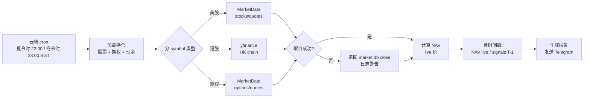

# Portfolio Intelligence Live Intraday Snapshot Implementation Plan

> **For Claude:** REQUIRED SUB-SKILL: Use superpowers:executing-plans to implement this plan task-by-task.

**Confidence: 80%**

**不确定点**:
- MarketData `stocks/quotes/{symbol}` 实际返回是否 realtime（需 Task 1 验证）
- MarketData 极端情况行为：美股节假日、停牌、pre/post-market 时 `s != ok` 的返回结构（需 Task 5 防御性处理）

**北极星对齐**: 第四层 **CIO-A（组合管理）**，升级 Portfolio Intelligence 数据精度。不新增层，不改架构，只把 NAV 估价口径从 "前一日 close" 换成 "盘中 live quote"。对应 CIO-A 描述中的"组合层风险诊断（敞口、集中度、等效 β）"——估价精度直接影响这些诊断的准确性。

**Revision Note (2026-04-22):** v2 修正了 6 个执行级问题：云端 smoke 必须跑分支代码而不是生产 checkout；MarketData freshness / credits 观测必须先补 client contract；报告要明确区分 `NAV=live` 与 `signals=T-1`；22:00 SGT 只在美东夏令时对应 ET 10:00，冬令时需切到 23:00 SGT；curl 探测命令的 Authorization 头要和现有 client 一致；worktree 创建命令要能在新分支不存在时直接成功。

**Goal:** 让 Portfolio Intelligence 在美东开盘后 30 分钟左右（夏令时 22:00 SGT / 冬令时 23:00 SGT）用 MarketData live quote 计算股票 + 期权净值，替代当前的"前一交易日 close + yfinance 期权 mid"组合；同时显式标注 `NAV live snapshot` 与 `signals/T-1 daily` 的口径差异。

**Tech Stack:** Python 3.10 (云端) / MarketData.app `/stocks/quotes` + `/options/quotes` / SQLite market.db (historical only) / yfinance (HK 兜底)

---

## Architecture（架构图）

```mermaid
graph TD
    PI[portfolio_intelligence.py<br/>云端 cron (夏 22 / 冬 23 SGT)] --> LIVE[live_quote_provider.py<br/>新模块]
    PI --> HIST[market.db<br/>daily_price 历史序列]

    LIVE --> MD_STOCK[MarketData<br/>/stocks/quotes/SYM]
    LIVE --> MD_OPT[MarketData<br/>/options/quotes/OCC]
    LIVE --> META[quote_meta + credit headers<br/>新可观测层]
    LIVE --> YF_HK[yfinance<br/>HK ticker fallback]
    LIVE --> FALLBACK[market.db last close<br/>异常兜底]

    HIST --> INDICATORS[PMARP/RVOL/EMA120<br/>历史序列计算]
    LIVE --> NAV[get_total_nav<br/>股票 + 期权 + 现金]

    NAV --> REPORT[Telegram 报告<br/>含 NAV 快照时间戳 + freshness 标签]
    INDICATORS --> REPORT

    classDef new fill:#d4f4dd,stroke:#2d8f3f
    classDef external fill:#e8e8e8,stroke:#666
    class LIVE,NAV new
    class MD_STOCK,MD_OPT,META,YF_HK,FALLBACK external
```

> **一句话解释**：新增 `live_quote_provider.py` 专职盘中取价，NAV 计算走 live 路径；历史指标（PMARP/RVOL）照旧走 market.db；同时把 quote freshness / credit header 一并带回报告和日志，避免“看起来 live 但其实无法证伪”的假精确。

## Business Flow（业务流程图）



> **一句话解释**：Boss 视角：每天收到 Telegram，报告头部明确标 `NAV 快照 ET HH:MM`，并注明信号仍基于日线历史序列，避免把整条报告误读成“全量盘中”。

## Alternatives Considered（替代方案）

| 方案 | 优势 | 劣势 | 选择理由 |
|------|------|------|----------|
| **A. MarketData 股票 + 期权 live quote**（推荐） | 一个 provider，云端固定 IP 稳定，期权质量高 | 消耗 ~20 credits/天（股票 15 + 期权 5） | Boss 已批准 |
| B. FMP `/quote` 批量 + MarketData 期权 | FMP Starter 版免费批量取价 | FMP 股票 quote 延迟 15 分钟，双 provider 代码分叉 | 延迟 15min → 10:00 am 跑等于 9:45 数据，失去盘中意义 |
| C. yfinance 全量 | 免费，已有代码 | 延迟 15 分钟 + 稳定性差 + 批量循环慢 | 同 B |
| D. 加 `--live` / `--close` 开关 | 灵活 | 代码路径分叉，Boss 已说"默认就 live" | YAGNI |

## Risks & Mitigation（风险自证）

- **最大风险 1: 美股休市/停牌/盘前时 `stocks/quotes` 返回 `s=no_data`**
  - Mitigation: 每个 symbol 取价失败 → 退回 market.db last close，日志打 `[fallback] SYM → close $X from YYYY-MM-DD`，报告头部 summary 显示 `live: 13/15, fallback: 2/15`
  - 完全异常（API down）时：整批退回 close 模式，报告头部标 "⚠️ MarketData 不可用，使用 T-1 close"

- **最大风险 2: 期权 OCC 代码转换错误导致报错**
  - Mitigation: 新写 `build_occ_symbol(symbol, expiration, strike, side)` 工具函数，单测覆盖典型例子（小数 strike / 长短 ticker / weekly expiration）；转换失败时 fallback 到 avg_premium，日志警告

- **最大风险 3: MarketData credits 额度被意外耗尽**
  - Mitigation: 先在 `src/data/marketdata_client.py` 增补 metadata helper，把响应头透传给 PI；如果响应头不存在，日志降级为 `request_count=N (credit header unavailable)`，不伪造 `remaining`
  - `/options/quotes` 只对持仓腿调用（当前 ~5 条），不做批量扫描；预估：15 stocks + 5 options = 20 credits × 22 工作日 = 440/月，远低于 10K/月

- **最大风险 4: 港股盘中问题 — 当前夏令时窗口下港股已收盘**
  - Analysis: 当前 cron 夏令时为 22:00 SGT/CST，HK 时间同为 22:00；港股收盘时间 16:00，已收盘 6 小时，yfinance 返回当天收盘价即可，**不是问题**

- **最大风险 5: 报告写着“盘中快照”，但 PMARP/RVOL/EMA120 其实仍是 T-1 日线**
  - Mitigation: 报告头部显式写 `NAV live snapshot` 和 `signals: daily history as of YYYY-MM-DD`；不输出含糊的 `delay ~N min`，除非 quote metadata 已真实可得

- **最大风险 6: 云端 smoke test 实际跑的是生产 checkout，不是当前 worktree 分支**
  - Mitigation: 所有 pre-approval 云端验证统一走 `/tmp/finance-pi-live-nav` 临时 smoke 目录：先 rsync 当前 worktree，再 symlink `/root/workspace/Finance/data` + `.env`，用云端 `.venv` 执行；未获 Boss 批准前，不 `git pull` 生产目录

- **最大风险 7: DST 切换后 22:00 SGT 变成 ET 09:00（开盘前）**
  - Mitigation: 保持 cron 语义为“美东开盘后约 30 分钟”。计划中明确：夏令时 22:00 SGT，冬令时 23:00 SGT；生产发布时同步更新 crontab 注释和运维文档

- **为什么不用更简单的做法:** 最简单 = "留着现在的 T-1 close 不改"。但 Boss 诉求就是解决盘中净值失真，不改不满足需求。其次简单 = "只改股票，期权留 yfinance"——但 yfinance 期权 mid 质量差是已知问题，顺手换掉性价比最高。

- **回滚方案:** 新模块独立（`live_quote_provider.py`），`portfolio_intelligence.py` 的改动集中在 `run_intelligence()` 中的 `price_latest` / `option_prices` 两段赋值（~20 行）；如果线上出事，单次 commit revert 即可，market.db + 持仓数据不受影响。

## Acceptance Criteria（验收标准）

- [ ] 本地测试通过后，把当前 worktree rsync 到云端临时 smoke 目录执行 `--dry-run`，确认跑的是分支代码而不是生产 checkout
- [ ] 报告头部出现 `📍 NAV 快照 ET YYYY-MM-DD HH:MM`，并同时标注 `signals as of YYYY-MM-DD`
- [ ] 报告中股票市值与 MarketData `/stocks/quotes/{SYM}` 返回的 `mid` 或 `last` 一致（抽查 3 只）
- [ ] 报告中期权市值与 MarketData `/options/quotes/{OCC}` 返回的 `mid` 一致（抽查所有腿）
- [ ] 股票取价失败时报告或日志显示 `⚠️ SYM fallback -> T-1 close $X from YYYY-MM-DD`
- [ ] 日志输出以下两者之一：`credits used/remaining`（若 header 可得）或 `request_count=N (credit header unavailable)`（若 header 不可得）
- [ ] 港股持仓仍走 yfinance，不触发 MarketData 调用
- [ ] 跑一次后 MarketData 账号 credits 消耗 ≤ 30（预估 20，留 50% 缓冲）
- [ ] 生产 cron 验证分两段：pre-approval 只做临时 smoke；post-approval deploy 后首个工作日 cron 成功，`logs/cron_intelligence.log` 无 traceback
- [ ] 现有 test suite（1512 passing）不 regress

## Verification Lanes（验证分层）

- **Lane A: Local deterministic tests** — 在 worktree 本地跑单测和格式化，不依赖 MarketData live 环境
- **Lane B: Cloud smoke on branch snapshot** — rsync 当前 worktree 到 aliyun 临时目录，用云端固定 IP + 共享 `data/` / `.env` 做真实 MarketData 测试；这是 merge 前的唯一云端验收路径
- **Lane C: Production cron** — 只有 Boss 明确批准 merge / deploy 后才执行；用于验证定时任务和 Telegram 真实送达，不作为 pre-approval 阶段 blocker

---

## Task Breakdown

### Task 0: 准备 worktree + 环境确认

**Step 1: 创建 worktree**

```bash
cd /Users/owen/CC\ workspace/Finance
git worktree add -b feat/pi-live-intraday-snapshot ../Finance-live-nav HEAD
cd ../Finance-live-nav
```

**Step 2: 约定 cloud smoke 目录（merge 前专用）**

```bash
export CLOUD_SMOKE_DIR=/tmp/finance-pi-live-nav
```

规则：后续所有“云端手动验证”都在这个临时目录执行，不 `git pull` 生产目录 `/root/workspace/Finance`。

**Step 3: 验证云端 MarketData key 可用 + 记录 raw quote 字段**

```bash
ssh aliyun "cd /root/workspace/Finance && source .env && curl -s -D /tmp/pi_md_headers.txt -H \"Authorization: Bearer \$MARKETDATA_API_KEY\" 'https://api.marketdata.app/v1/stocks/quotes/AAPL/' | python3 -m json.tool"
```

Expected:
- JSON with `"s": "ok"`, `"last": [...]`, `"bid": [...]`, `"ask": [...]`
- `/tmp/pi_md_headers.txt` 能看到是否存在 credits/quota 相关 header
- raw body 里如果有 `updated` / `timestamp` / delayed 标识，记录真实字段名；如果没有，就在后续 plan 中按“freshness unavailable”降级

**Step 4: 确认现有 `MarketDataClient` 的 backward-compatible contract**

```bash
ssh aliyun "cd /root/workspace/Finance && source .env && python3 - <<'PY'\nfrom src.data.marketdata_client import MarketDataClient\nc = MarketDataClient()\nprint(c.get_stock_quote('AAPL'))\nPY"
```

Expected: `get_stock_quote()` 继续返回 `last/bid/ask/mid` 的标量 dict。后续 Task 2 只能新增 `*_with_meta()` helper，不能破坏现有 public API。

**Step 5: 验证 branch snapshot 的 cloud smoke 路径可跑**

```bash
rsync -az --delete --exclude '.git' --exclude '.venv' /Users/owen/CC\ workspace/Finance-live-nav/ aliyun:/tmp/finance-pi-live-nav/
ssh aliyun "cd /tmp/finance-pi-live-nav && ln -snf /root/workspace/Finance/data data && ln -snf /root/workspace/Finance/.env .env && /root/workspace/Finance/.venv/bin/python -c 'import scripts.portfolio_intelligence as pi; print(pi.is_hk_ticker(\"07709\"))'"
```

Expected: 返回 `True`，证明临时 smoke 目录 import 正常、能复用云端 data / .env / .venv。

**Step 6: Commit（空 commit 作为分支基准）**

```bash
git commit --allow-empty -m "chore: baseline for PI live intraday snapshot feature"
```

---

### Task 1: OCC 期权代码构建工具 + 单测

**Files:**
- Create: `terminal/options/occ_symbol.py`
- Test: `tests/terminal/options/test_occ_symbol.py`

**Step 1: Write the failing test**

```python
# tests/terminal/options/test_occ_symbol.py
import pytest
from terminal.options.occ_symbol import build_occ_symbol


def test_standard_call():
    # AAPL 2026-03-21 Call @ $200
    assert build_occ_symbol("AAPL", "2026-03-21", 200.0, "CALL") == "AAPL260321C00200000"


def test_standard_put():
    assert build_occ_symbol("AAPL", "2026-03-21", 200.0, "PUT") == "AAPL260321P00200000"


def test_lowercase_side():
    assert build_occ_symbol("AAPL", "2026-03-21", 200.0, "call") == "AAPL260321C00200000"


def test_fractional_strike():
    # NVDA 2026-06-20 Call @ $152.5
    assert build_occ_symbol("NVDA", "2026-06-20", 152.5, "CALL") == "NVDA260620C00152500"


def test_small_strike():
    # SOFI Call @ $7.5
    assert build_occ_symbol("SOFI", "2026-12-19", 7.5, "CALL") == "SOFI261219C00007500"


def test_long_ticker():
    # Example with 5-char ticker
    assert build_occ_symbol("GOOGL", "2026-03-21", 180.0, "CALL") == "GOOGL260321C00180000"


def test_invalid_side():
    with pytest.raises(ValueError, match="side must be"):
        build_occ_symbol("AAPL", "2026-03-21", 200.0, "X")


def test_invalid_date():
    with pytest.raises(ValueError):
        build_occ_symbol("AAPL", "not-a-date", 200.0, "CALL")
```

**Step 2: Run test to verify failure**

Run: `pytest tests/terminal/options/test_occ_symbol.py -v`
Expected: 8 tests FAIL (ModuleNotFoundError)

**Step 3: Implement**

```python
# terminal/options/occ_symbol.py
"""OCC-standard option symbol builder.

Format: SYMBOL + YYMMDD + C/P + STRIKE*1000 padded to 8 digits
Example: AAPL 2026-03-21 Call @ $200 → AAPL260321C00200000
Reference: https://www.theocc.com/company-information/publications/symbology
"""
from datetime import datetime


def build_occ_symbol(symbol: str, expiration: str, strike: float, side: str) -> str:
    side_upper = side.upper()
    if side_upper not in ("CALL", "PUT"):
        raise ValueError(f"side must be CALL or PUT, got {side}")

    exp_dt = datetime.strptime(expiration, "%Y-%m-%d")
    date_part = exp_dt.strftime("%y%m%d")

    cp = "C" if side_upper == "CALL" else "P"
    strike_int = int(round(strike * 1000))
    strike_part = f"{strike_int:08d}"

    return f"{symbol.upper()}{date_part}{cp}{strike_part}"
```

**Step 4: Run tests to verify PASS**

Run: `pytest tests/terminal/options/test_occ_symbol.py -v`
Expected: 8 PASS

**Step 5: Commit**

```bash
git add terminal/options/occ_symbol.py tests/terminal/options/test_occ_symbol.py
git commit -m "feat(options): add OCC symbol builder for live quote lookup"
```

---

### Task 2: MarketData metadata helper + 股票 live quote provider

**Files:**
- Modify: `src/data/marketdata_client.py`
- Test: `tests/test_marketdata_client.py`
- Create: `portfolio/holdings/live_quote_provider.py`
- Test: `tests/portfolio/holdings/test_live_quote_provider.py`

**Step 1: Write failing tests for backward-compatible metadata helpers**

新增两组测试：

```python
# tests/test_marketdata_client.py
def test_get_stock_quote_with_meta_keeps_raw_and_headers(...):
    result = client.get_stock_quote_with_meta("AAPL")
    assert result["quote"]["mid"] == 225.50
    assert result["raw"]["s"] == "ok"
    assert "headers" in result

def test_get_stock_quote_stays_backward_compatible(...):
    result = client.get_stock_quote("AAPL")
    assert result == {"last": 225.50, "bid": 225.40, "ask": 225.60, "mid": 225.50}
```

```python
# tests/portfolio/holdings/test_live_quote_provider.py
def test_stock_quote_success_captures_meta_and_price_field():
    mock_client.get_stock_quote_with_meta.side_effect = [
        {
            "quote": {"last": 150.5, "mid": 150.4, "bid": 150.3, "ask": 150.5},
            "raw": {"s": "ok", "updated": ["2026-04-22T10:05:00-04:00"]},
            "headers": {"X-Api-Cost": "1", "X-Api-Quota-Remaining": "9999"},
        },
        {
            "quote": {"last": 800.1, "bid": 799.9, "ask": 800.1},
            "raw": {"s": "ok"},
            "headers": {},
        },
    ]
    result = fetch_stock_live_quotes(["AAPL", "NVDA"], client=mock_client)
    assert result.prices == {"AAPL": 150.4, "NVDA": 800.1}
    assert result.quote_meta["AAPL"]["price_field"] == "mid"
    assert result.quote_meta["NVDA"]["price_field"] == "last"
    assert result.request_count == 2
```

**Step 2: Verify fail**

Run:
- `pytest tests/test_marketdata_client.py -k "stock_quote_with_meta or backward_compatible" -v`
- `pytest tests/portfolio/holdings/test_live_quote_provider.py -k stock_quote -v`

**Step 3: Implement `MarketDataClient` metadata helpers without breaking public API**

实现策略：

- 保留现有 `get_stock_quote()` / `get_options_quote()` 返回值不变，避免影响旧调用方和现有测试
- 新增：
  - `get_stock_quote_with_meta(symbol) -> {"quote": ..., "raw": ..., "headers": ...}`
  - `get_options_quote_with_meta(option_symbol) -> {"quote": ..., "raw": ..., "headers": ...}`
- `_request()` 增加一个仅供 helper 使用的内部变体，例如 `_request_with_meta()`，返回 `(data, headers)`
- 如果 header 中没有 credits/quota 字段，不报错，后续统一降级为 `credit header unavailable`

关键数据结构：

```python
@dataclass
class QuoteResult:
    prices: Dict = field(default_factory=dict)
    failed: List = field(default_factory=list)
    quote_meta: Dict = field(default_factory=dict)
    request_count: int = 0
    credit_header_available: bool = False
    credits_used: str | None = None
    credits_remaining: str | None = None
```

Provider 选择价格时记录来源字段：

```python
def _pick_price(quote: dict) -> tuple[float | None, str | None]:
    if quote.get("mid"):
        return float(quote["mid"]), "mid"
    if quote.get("last"):
        return float(quote["last"]), "last"
    bid, ask = quote.get("bid"), quote.get("ask")
    if bid and ask:
        return (float(bid) + float(ask)) / 2, "bbo_mid"
    return None, None
```

并把 metadata 存进去：

```python
payload = client.get_stock_quote_with_meta(sym)
price, field = _pick_price(payload["quote"])
result.quote_meta[sym] = {
    "price_field": field,
    "raw_status": payload["raw"].get("s"),
    "updated": payload["raw"].get("updated"),
}
```

**Step 4: Verify pass**

Run:
- `pytest tests/test_marketdata_client.py -k "stock_quote" -v`
- `pytest tests/portfolio/holdings/test_live_quote_provider.py -k stock_quote -v`

Expected:
- 旧的 `MarketDataClient.get_stock_quote()` 测试不 regress
- 新 helper 能带回 raw + headers
- `QuoteResult` 同时具备 `prices`, `quote_meta`, `request_count`

**Step 5: Commit**

```bash
git add src/data/marketdata_client.py tests/test_marketdata_client.py portfolio/holdings/live_quote_provider.py tests/portfolio/holdings/test_live_quote_provider.py
git commit -m "feat(portfolio): add MarketData metadata helpers and live stock quote provider"
```

---

### Task 3: Live quote provider 扩展 — 期权

**Files:**
- Modify: `portfolio/holdings/live_quote_provider.py`
- Modify: `tests/portfolio/holdings/test_live_quote_provider.py`

**Step 1: Add failing test**

```python
# append to tests/portfolio/holdings/test_live_quote_provider.py
from portfolio.holdings.live_quote_provider import fetch_option_live_quotes


def test_option_quote_success():
    mock_client = MagicMock()
    mock_client.get_options_quote_with_meta.return_value = {
        "quote": {"mid": 2.50, "last": 2.55, "bid": 2.45, "ask": 2.55},
        "raw": {"s": "ok", "updated": ["2026-04-22T10:05:00-04:00"]},
        "headers": {"X-Api-Cost": "1"},
    }
    positions = [{
        "symbol": "AAPL",
        "expiration": "2026-03-21",
        "strike": 200.0,
        "side": "CALL",
    }]
    result = fetch_option_live_quotes(positions, client=mock_client)
    key = ("AAPL", "2026-03-21", 200.0, "CALL")
    assert result.prices[key] == 2.50
    assert result.failed == []
    assert result.quote_meta[key]["price_field"] == "mid"
    mock_client.get_options_quote_with_meta.assert_called_once_with("AAPL260321C00200000")


def test_option_quote_failure_adds_to_failed():
    mock_client = MagicMock()
    mock_client.get_options_quote_with_meta.return_value = None
    positions = [{
        "symbol": "AAPL",
        "expiration": "2026-03-21",
        "strike": 200.0,
        "side": "CALL",
    }]
    result = fetch_option_live_quotes(positions, client=mock_client)
    assert result.prices == {}
    assert len(result.failed) == 1


def test_option_quote_invalid_occ_caught():
    mock_client = MagicMock()
    positions = [{
        "symbol": "AAPL",
        "expiration": "bad-date",
        "strike": 200.0,
        "side": "CALL",
    }]
    result = fetch_option_live_quotes(positions, client=mock_client)
    assert result.prices == {}
    assert len(result.failed) == 1
    mock_client.get_options_quote_with_meta.assert_not_called()
```

**Step 2: Verify fail**

Run: `pytest tests/portfolio/holdings/test_live_quote_provider.py::test_option_quote_success -v`

**Step 3: Implement**

```python
# append to portfolio/holdings/live_quote_provider.py
from terminal.options.occ_symbol import build_occ_symbol


def _pick_option_price(quote: dict) -> tuple[Optional[float], Optional[str]]:
    for key in ("mid", "last"):
        if quote.get(key):
            return float(quote[key]), key
    bid = quote.get("bid")
    ask = quote.get("ask")
    if bid and ask:
        return (float(bid) + float(ask)) / 2, "bbo_mid"
    return None, None


def fetch_option_live_quotes(positions: List[dict], client=None) -> QuoteResult:
    """Fetch live option quotes via MarketData.

    positions: list of {symbol, expiration (YYYY-MM-DD), strike, side (CALL/PUT)}
    Returns QuoteResult where prices keyed by (symbol, expiration, strike, side).
    """
    result = QuoteResult()
    if not positions:
        return result
    if client is None:
        from src.data.marketdata_client import MarketDataClient
        client = MarketDataClient()

    for p in positions:
        key = (p["symbol"], p["expiration"], p["strike"], p["side"])
        try:
            occ = build_occ_symbol(p["symbol"], p["expiration"], p["strike"], p["side"])
        except Exception as e:
            logger.warning("Failed to build OCC for %s: %s", key, e)
            result.failed.append(key)
            continue

        try:
            payload = client.get_options_quote_with_meta(occ)
        except Exception as e:
            logger.warning("MarketData option quote exception for %s: %s", occ, e)
            result.failed.append(key)
            continue

        if not payload or payload["raw"].get("s") != "ok":
            result.failed.append(key)
            continue

        price, field = _pick_option_price(payload["quote"])
        if price is None:
            result.failed.append(key)
            continue
        result.prices[key] = price
        result.quote_meta[key] = {
            "occ": occ,
            "price_field": field,
            "updated": payload["raw"].get("updated"),
        }
        logger.info("[live] option %s = $%.2f", occ, price)

    return result
```

**Step 4: Verify pass**

Run: `pytest tests/portfolio/holdings/test_live_quote_provider.py -v`
Expected: 9 PASS total

**Step 5: Commit**

```bash
git add portfolio/holdings/live_quote_provider.py tests/portfolio/holdings/test_live_quote_provider.py
git commit -m "feat(portfolio): add live option quote provider via MarketData OCC"
```

---

### Task 4: 接入 PI 主流程 — 股票 live quote

**Files:**
- Modify: `scripts/portfolio_intelligence.py`（替换 `price_latest` 取值逻辑）
- Modify: `tests/test_telegram_routing.py`（补一条正常路径 smoke，防报告头部 contract 回归）

**Step 1: 读取当前 `run_intelligence()` 取价块**

Read: `scripts/portfolio_intelligence.py:308-360`

**Step 2: 修改股票取价逻辑**

把 `price_latest[p.symbol] = df["close"].iloc[-1]` 改成两阶段：
1. 先走 market.db 把历史 `df` 加载到 `prices_map`（不变，指标需要）
2. 新增：MarketData live quote 覆盖 `price_latest`
3. 记录 `stock_live_meta` / `fallback_symbols` / `signals_as_of`
4. Fallback：MarketData 失败的 symbol → 用 market.db last close 填回

修改后的片段（替换 `scripts/portfolio_intelligence.py` 的 332-344 行附近）：

```python
# Load historical price series from market.db (for indicators)
for p in positions:
    if is_hk_ticker(p.symbol):
        continue  # HK handled separately via yfinance
    rows = conn.execute(
        "SELECT date, open, high, low, close, volume FROM daily_price "
        "WHERE symbol = ? ORDER BY date DESC LIMIT 200",
        (p.symbol,),
    ).fetchall()
    if rows:
        df = pd.DataFrame([dict(r) for r in reversed(rows)])
        df["close"] = pd.to_numeric(df["close"])
        df["volume"] = pd.to_numeric(df["volume"])
        prices_map[p.symbol] = df
conn.close()

# Live intraday quotes (US stocks only; HK handled below)
from portfolio.holdings.live_quote_provider import fetch_stock_live_quotes
us_symbols = [p.symbol for p in positions if not is_hk_ticker(p.symbol)]
live_result = fetch_stock_live_quotes(us_symbols)
price_latest.update(live_result.prices)
stock_live_meta = live_result.quote_meta
logger.info(
    "Stock live quotes: %d/%d success, failed=%s, request_count=%d",
    len(live_result.prices), len(us_symbols), live_result.failed, live_result.request_count,
)

# Fallback: any live-failed symbol → last close from market.db
for sym in live_result.failed:
    df = prices_map.get(sym)
    if df is not None and len(df) > 0:
        price_latest[sym] = float(df["close"].iloc[-1])
        fallback_symbols.append(sym)
```

Add near top of `run_intelligence()`:

```python
fallback_symbols: list[str] = []
stock_live_meta: dict[str, dict] = {}
signals_as_of: str | None = None
```

并在读取日线数据时顺手记下：

```python
signals_as_of = max(signals_as_of or "", str(df["date"].iloc[-1]))
```

**Step 3: 本地测试 + branch snapshot 云端 smoke**

```bash
pytest tests/test_telegram_routing.py -k portfolio_intelligence -v
rsync -az --delete --exclude '.git' --exclude '.venv' /Users/owen/CC\ workspace/Finance-live-nav/ aliyun:/tmp/finance-pi-live-nav/
ssh aliyun "cd /tmp/finance-pi-live-nav && ln -snf /root/workspace/Finance/data data && ln -snf /root/workspace/Finance/.env .env && /root/workspace/Finance/.venv/bin/python scripts/portfolio_intelligence.py --dry-run 2>&1 | head -80"
```

Expected:
- 日志出现 `Stock live quotes: N/M success`
- 日志出现 `request_count=`，如果 header 可得再额外出现 credits/quota
- 不出现 Traceback
- dry-run 输出报告包含股票行，价格与 MarketData 实时一致

**Step 4: Commit**

```bash
git add scripts/portfolio_intelligence.py
git commit -m "feat(pi): use MarketData live stock quotes for intraday NAV"
```

---

### Task 5: 接入 PI 主流程 — 期权 live quote 切换到 MarketData

**Files:**
- Modify: `scripts/portfolio_intelligence.py`（替换 `fetch_option_prices` 调用）

**Step 1: 修改期权取价逻辑**

替换 `scripts/portfolio_intelligence.py:362-367`:

```python
# Fetch option live prices via MarketData (was yfinance)
option_prices = {}
option_failed: list[tuple] = []
option_live_meta: dict[tuple, dict] = {}
if option_positions:
    from portfolio.holdings.live_quote_provider import fetch_option_live_quotes
    logger.info("Fetching MarketData option quotes for %d legs...", len(option_positions))
    opt_result = fetch_option_live_quotes(option_positions)
    option_prices = opt_result.prices
    option_failed = opt_result.failed
    option_live_meta = opt_result.quote_meta
    logger.info(
        "Option live quotes: %d/%d success, failed=%s, request_count=%d",
        len(option_prices), len(option_positions), option_failed, opt_result.request_count,
    )
```

**Step 2: 删除 yfinance 期权取价代码**

标记为 deprecated 或删除 `fetch_option_prices()` / `_yf_option_mid()`（`scripts/portfolio_intelligence.py:141-156` 及相关 helper）。如果其他地方有引用先 grep 确认。

```bash
grep -rn "fetch_option_prices\|_yf_option_mid" /Users/owen/CC\ workspace/Finance/ --include="*.py" | grep -v __pycache__
```

如果只有 `portfolio_intelligence.py` 自引用 → 直接删除。

**Step 3: branch snapshot 云端 smoke**

```bash
rsync -az --delete --exclude '.git' --exclude '.venv' /Users/owen/CC\ workspace/Finance-live-nav/ aliyun:/tmp/finance-pi-live-nav/
ssh aliyun "cd /tmp/finance-pi-live-nav && ln -snf /root/workspace/Finance/data data && ln -snf /root/workspace/Finance/.env .env && /root/workspace/Finance/.venv/bin/python scripts/portfolio_intelligence.py --dry-run 2>&1 | grep -E 'option|Option|request_count|credit'"
```

Expected: 所有期权腿都拿到 MarketData price，且日志 `[live] option OCC = $X.XX` 符合预期；若 credits header 不可得，日志明确写 `credit header unavailable`

**Step 4: Commit**

```bash
git add scripts/portfolio_intelligence.py
git commit -m "feat(pi): switch option live quotes from yfinance to MarketData"
```

---

### Task 6: 报告头部盖时间戳 + fallback 标注

**Files:**
- Modify: `scripts/portfolio_intelligence.py`（报告 formatter 部分）
- Modify: `tests/test_portfolio/test_intelligence.py`

**Step 1: 找到报告开头的 formatter**

```bash
grep -n "组合概览\|Portfolio Intelligence\|def format_report\|🎯\|📊" /Users/owen/CC\ workspace/Finance/scripts/portfolio_intelligence.py | head -20
```

**Step 2: 在报告第一行插入 snapshot line，并明确区分 NAV / signals freshness**

使用 US/Eastern 时区；只有在 metadata 真实可得时才显示 delay/freshness 细节，否则明确写 `freshness unavailable`：

```python
from zoneinfo import ZoneInfo
from datetime import datetime

et_now = datetime.now(ZoneInfo("America/New_York"))
snapshot_line = (
    f"📍 NAV 快照 ET {et_now.strftime('%Y-%m-%d %H:%M')} "
    f"| live {len(live_result.prices)}/{len(us_symbols)} "
    f"| signals as of {signals_as_of or 'unknown'}"
)

if fallback_symbols:
    snapshot_line += f" | ⚠️ fallback: {','.join(fallback_symbols)}"
if option_failed:
    snapshot_line += f" | ⚠️ opt_fail: {len(option_failed)}"
if live_result.credit_header_available:
    snapshot_line += f" | credits {live_result.credits_used}/{live_result.credits_remaining}"
else:
    snapshot_line += " | credit header unavailable"
```

把 `snapshot_line` 插到报告最顶部（在 `📊 *组合概览*` 之前）。

同时补两条测试：

```python
def test_format_report_includes_snapshot_line():
    report = format_report(..., snapshot_line="📍 NAV 快照 ET 2026-04-22 10:05 | live 1/1 | signals as of 2026-04-21")
    assert report.splitlines()[0].startswith("📍 NAV 快照 ET")

def test_format_report_does_not_claim_delay_when_unavailable():
    report = format_report(..., snapshot_line="📍 NAV 快照 ET 2026-04-22 10:05 | credit header unavailable")
    assert "delay ~" not in report
```

**Step 3: branch snapshot 云端 smoke；Telegram 真发只留到 post-approval**

```bash
rsync -az --delete --exclude '.git' --exclude '.venv' /Users/owen/CC\ workspace/Finance-live-nav/ aliyun:/tmp/finance-pi-live-nav/
ssh aliyun "cd /tmp/finance-pi-live-nav && ln -snf /root/workspace/Finance/data data && ln -snf /root/workspace/Finance/.env .env && /root/workspace/Finance/.venv/bin/python scripts/portfolio_intelligence.py --dry-run | head -20"
```

Expected: dry-run 第一行出现 `📍 NAV 快照 ET ... | live ... | signals as of ...`。真正 Telegram 实发放到 Boss 批准 deploy 后执行。

**Step 4: Commit**

```bash
git add scripts/portfolio_intelligence.py
git commit -m "feat(pi): stamp intraday snapshot timestamp and fallback status"
```

---

### Task 7: 回归测试 + credits 监控

**Step 1: 跑全套 test suite**

```bash
cd /Users/owen/CC\ workspace/Finance-live-nav
source /Users/owen/CC\ workspace/Finance/.venv/bin/activate
pytest tests/ -x --timeout=60 2>&1 | tail -30
```

Expected: 所有既有测试 pass（基线 1512 passing，新增 ~15 个用例）

**Step 2: 连续 3 次手动触发，观测 credits 消耗**

```bash
for i in 1 2 3; do
  rsync -az --delete --exclude '.git' --exclude '.venv' /Users/owen/CC\ workspace/Finance-live-nav/ aliyun:/tmp/finance-pi-live-nav/
  ssh aliyun "cd /tmp/finance-pi-live-nav && ln -snf /root/workspace/Finance/data data && ln -snf /root/workspace/Finance/.env .env && /root/workspace/Finance/.venv/bin/python scripts/portfolio_intelligence.py --dry-run 2>&1 | grep -iE 'credit|request_count|quota'"
  sleep 30
done
```

Expected: 单次运行最多 15 美股 + 期权腿数 次请求；若 credits header 存在，单次 credits 消耗 ≤ 30；若 header 不存在，至少能稳定观测 `request_count`

**Step 3: 验收清单逐项确认**

对照 Acceptance Criteria 每一条手动 check。

**Step 4: 文档更新**

更新 `CLAUDE.md` 的数据源章节：
- MarketData.app 职能从"期权链+IV"扩展到"期权链+IV+盘中股票报价+PI NAV 估值"
- 新增 `portfolio/holdings/live_quote_provider.py` 到导航地图
- 补一句 DST 运维约束：PI cron 夏令时 22:00 SGT，冬令时 23:00 SGT

**Step 5: Commit + merge 计划**

```bash
git add CLAUDE.md
git commit -m "docs: update MarketData scope and live_quote_provider location"
```

之后等 Boss 批准合并进 main，不自作主张 push/merge。

---

## 代码审查 Checklist（自审，合并前跑）

- [ ] 新增模块有单测覆盖所有 public function
- [ ] 主流程改动后 dry-run 无 Traceback
- [ ] yfinance 期权代码路径完全删除（无 dead code）
- [ ] 日志完整：live/fallback/credits-or-request_count 三类信息都可见
- [ ] 报告格式在 Telegram 上渲染正常
- [ ] MarketData API key 未在代码中硬编码（走 env var）
- [ ] 港股仍走 yfinance（MarketData 不覆盖港股）
- [ ] 报告没有把 `signals` 误写成“盘中实时”
- [ ] merge 前所有云端验证都走 `/tmp/finance-pi-live-nav`，没有误操作生产 checkout
- [ ] DST 规则已写进文档/运维说明
- [ ] 北极星对齐：CIO-A 层改动，不新增层

---

## 执行约定

- 全流程在 worktree `feat/pi-live-intraday-snapshot` 内完成
- 不主动 merge / push / 改云端 crontab — 任何发布操作等 Boss 明确批准
- 每个 Task commit 完立即进 next Task，不批量
- 遇到不确定（MarketData 响应格式和预期不符 / 期权 OCC 构建失败模式）→ 停下来问 Boss
