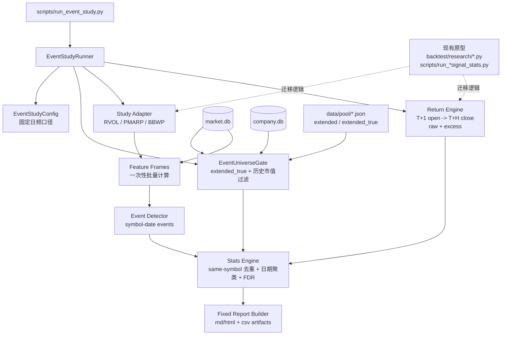
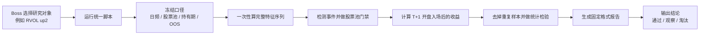

# Event Study Standardization Implementation Plan

> **For Claude:** REQUIRED SUB-SKILL: Use superpowers:executing-plans to implement this plan task-by-task.

**Confidence: 84%**
**不确定点**:
- `breadth` 的第一落点已冻结为“市场过滤器”；真正的“市场-日期事件”推迟到第三阶段。
- 当前 `backtest/research/*.py` 与 `scripts/run_*signal_stats.py` 原型主要存在于 Boss 的脏工作区，执行时需要把有效逻辑干净迁移到 tracked 代码，而不是直接依赖脏文件。
- “科技/成长子集” 的行业边界是否只用 `sector`，还是还要额外加主题/交易所/市值过滤，目前先按 `sector + mcap` 处理。
**北极星对齐**: 对齐 [docs/design/north-star.md](/Users/owen/CC%20workspace/Finance/.worktrees/event-study-standardization/docs/design/north-star.md) 的“分析层-技术/情绪因子验证”与 [docs/design/factor-backtest-north-star.md](/Users/owen/CC%20workspace/Finance/.worktrees/event-study-standardization/docs/design/factor-backtest-north-star.md) 的离线 R&D 方向。该计划只重构事件型因子研究，不触碰连续打分排名回测。

**Goal:** 把当前零散的日频事件型因子研究脚本，收敛成一条统一、可复用、较低幸存者偏差、固定报告格式的研究流程；第一阶段只覆盖“股票-日期事件”，并以 `RVOL` 作为标准样板。

**Tech Stack:** Python, pandas, numpy, scipy, SQLite (`market.db` / `company.db`), existing `USStocksAdapter`, `extended_true`, `historical_market_cap`, pytest

---

## Architecture（架构图）

> 一句话解释：新流程不是再堆一个 ad-hoc 脚本，而是把“股票池、事件定义、收益口径、统计检验、报告产物”固定成一条标准流水线。

## Business Flow（业务流程图）

> 一句话解释：用户只决定“研究哪个事件”，其余研究口径由协议固定，避免每个脚本各讲各的话。

## Alternatives Considered（替代方案）

| 方案 | 优势 | 劣势 | 选择理由 |
|------|------|------|----------|
| **A. 新建 `backtest/event_study/` 包，复用现有稳定模块（推荐）** | 和连续排名研究彻底分开；命名清楚；便于后续加 `breadth` 这类市场事件 | 需要迁移一部分已有原型 | 最符合这次“只谈事件型”的目标 |
| B. 继续把事件研究塞进 `backtest/factor_study/` | 复用现有 report/FDR/runner 代码多 | 事件型与连续打分继续混在一起；还会继承日频性能问题 | 不选，概念边界还是脏的 |
| C. 保留现有 ad-hoc 脚本，只统一报告模板 | 改动最少 | 研究口径仍然碎；没有真正统一 universe / return / overlap / artifacts | 只能治表，不治里 |

## Risks & Mitigation（风险自证）

- **最大风险:** 为了统一而过度抽象，最后得到一个“看起来正规但没人想用”的框架。
- **为什么不用更简单的做法:** 只统一报告格式不够，因为当前真正分裂的是 `universe`、`收益口径`、`样本去重` 和 `输出 schema`，不是排版。
- **为什么第一阶段不直接把 breadth 一起做掉:** `RVOL/PMARP/BBWP` 都是“股票-日期事件”，而 `breadth` 更像“市场-日期事件”。两者强行一起上马会把第一版协议搞复杂。
- **缓解方式:**
  - 第一阶段只支持 `symbol-date` 事件。
  - 只迁移一个成熟样板：`RVOL`。
  - `PMARP/BBWP` 在第二小步并入，不一口气迁完全部历史脚本。
  - `breadth` 单列第二阶段，等第一阶段协议站稳再接。
- **回滚方案:** 新代码全部落在 `backtest/event_study/` 和单独 CLI，旧 `factor_study`、旧 ad-hoc runner 不删不改。新流程不稳定就停用新入口。

## Acceptance Criteria（验收标准）

- [ ] 有一个统一入口可以跑 `RVOL` 事件研究，不再依赖专用 ad-hoc runner
- [ ] 默认股票池固定为 `extended_true + 历史市值门槛`
- [ ] 默认收益口径固定为 `T+1 开盘买入 -> T+H 收盘卖出`
- [ ] 报告固定输出 `摘要 / 测试口径 / 样本质量 / 主结果 / 分层结果 / 失效条件 / 结论 / 附录`
- [ ] CSV artifacts 至少包含 `summary.csv`、`event_level.csv`、`universe_audit.csv`
- [ ] 统计结果固定包含 `n_raw / n_dedup / n_scored / n_effective / p / p_fdr`
- [ ] `same-symbol de-overlap` 和 `date clustering` 默认开启且有测试
- [ ] 至少一组合成测试 + 一组真实 RVOL smoke run 通过
- [ ] 第一阶段不触碰 `RS backtest`、`IC analysis`、连续排名逻辑

---

## Scope Freeze（范围冻结）

### 第一阶段要做什么

1. 统一 `股票-日期事件` 研究协议
2. 固定日频收益口径、股票池口径、报告口径
3. 以 `RVOL` 作为第一条标准化 study
4. 产出一份可读、可审计的固定格式报告

### 第一阶段明确不做什么

- 不重构 `RS backtest`
- 不把连续打分和事件研究强行合并
- 不直接上 `breadth` 的完整实现
- 不引入 YAML spec / runs.db / ledger 这类更重的治理层
- 不追求 CRSP 级别的全市场完美历史股票池

### 第二阶段预留

- `PMARP / BBWP` 并入统一协议
- `breadth` 作为市场过滤器并入统一协议
- 科技/成长子集的固定切片

### 第三阶段预留

- `breadth_cross_down` 这类真正的市场-日期事件协议
- 独立市场事件的样本独立性和报告口径

## Design Decisions（关键设计决定）

### 1. 事件协议只支持日频

- 信号确认日：`T`
- 入场日：`T+1 open`
- 出场日：`T+H close`
- 默认 horizon：`5 / 10 / 20 / 60`
- 基准：`SPY`
- 主结果同时保留 `raw` 和 `excess`
- `SPY` 的 excess 口径与股票完全一致，统一按 `T+1 open -> T+H close`
- 若股票或 `SPY` 在 `T+H close` 不存在，则该事件直接 drop，不做 forward-fill

### 2. 股票池协议

- 候选名单：`extended_true`
- 当日是否允许入样本：用事件日 `T` 之前最近可得的历史市值判断
- 默认门槛：`$10B`
- 第一版不做“全市场真历史成分库”，只做“比今天幸存者名单更接近历史真实”的研究口径
- `universe_audit.csv` 必须输出按年汇总的 `eligible_count`，用于肉眼检查是否存在“早年样本断崖”

### 3. 样本独立性协议

- 同一只股票在持有窗未结束前再次触发：去重
- 同一天多只股票一起触发：按日期聚类后再做 t-test
- `same-symbol de-overlap` 采用**硬窗口排斥**：若 `H=60`，则保留第一个事件，之后直到第 61 个交易日才允许下一个事件
- 每个 `(window, return_type)` 组合内的所有 `(horizon, bucket)` 共用一个 BH-FDR 家族

### 4. 报告协议

- 报告先写结论，再写口径，再写细节
- 尽量用白话，避免不解释术语
- 每个结论都能回溯到口径和样本质量

### 5. OOS 协议

- 事件研究里的 `IS/OOS` 不表示训练模型，只表示报告层的时间切片
- 默认输出三份统计：
  - `Full`：全窗
  - `IS`：`oos_start` 之前
  - `OOS`：`oos_start` 之后
- 主结论以 `Full + OOS` 并排展示，避免只看全窗好看结果
- 若 `OOS` 样本过少，要显式写明“样本不足”，而不是默默省略

---

## Task 0: 迁移原型参考到 worktree 内

**Files:**
- Create: `backtest/event_study/_legacy_reference/`
- Copy into tracked reference area:
  - `backtest/research/daily_event_returns.py`
  - `backtest/research/rvol_signal_stats.py`
  - `backtest/research/pmarp_signal_stats.py`
  - `backtest/research/bbwp_signal_stats.py`
  - `backtest/research/pmarp_bbwp_study.py`
  - `scripts/run_rvol_signal_stats.py`
  - `scripts/run_pmarp_down98_signal_stats.py`
  - `scripts/run_bbwp_signal_stats.py`
  - `scripts/run_pmarp_bbwp_daily_study.py`
- Create: `backtest/event_study/_legacy_reference/README.md`

**Implementation notes:**
- 目的不是把这些原型变成正式入口，而是把“执行时需要参考的逻辑”冻结到 worktree 内，避免后续实现跨工作区引用 Boss 的脏文件。
- `_legacy_reference/` 只读，不在这里继续开发。
- README 要注明：
  - 来源路径
  - 拷贝日期
  - 这些文件只是迁移参考，不是标准协议实现

**Steps:**
1. 先在 worktree 内建 `_legacy_reference/`
2. 把需要迁移的原型文件拷贝进来
3. 写 README 说明“仅供迁移参考”
4. 跑 `git status --short` 确认引用物都在 worktree 内

**Expected result:**
- 后续 Task 3/4/5 不再跨工作区读未追踪文件
- subagent 或后续执行者拿到 worktree 就能完整复现上下文

## Task 1: 建立新的事件研究包骨架

**Files:**
- Create: `backtest/event_study/__init__.py`
- Create: `backtest/event_study/protocol.py`
- Create: `backtest/event_study/runner.py`
- Create: `tests/test_event_study/test_protocol.py`

**Implementation notes:**
- `protocol.py` 只放最小 dataclass / enum，不引入 YAML 配置层。
- 先定义清楚这些对象：
  - `EventStudyConfig`
  - `UniverseConfig`
  - `ReturnConfig`
  - `OverlapPolicy`
  - `StudyOutcome`
- 固定只支持 `symbol_date` 事件类型；`market_date` 只在注释里预留，不实现。

**Steps:**
1. 先写协议层测试，确保默认值就是我们刚冻结的口径
2. 实现最小 dataclass 和校验
3. 让 `runner.py` 先能接受 config 并返回空壳结果对象
4. 跑 `../../.venv/bin/pytest tests/test_event_study/test_protocol.py -q`

**Expected result:**
- 新包存在
- 协议层测试通过
- 还没有接任何真实 study，但入口壳子已经固定

## Task 2: 实现日频事件股票池门禁

**Files:**
- Create: `backtest/event_study/universe.py`
- Create: `tests/test_event_study/test_universe.py`
- Reference: `backtest/pipeline/primitives/universe_builder.py`
- Reference: `src/data/delisted_universe_manager.py`

**Implementation notes:**
- 不直接调用 `slice_to_date()` 循环全市场，这条路已经被 [008 issue](/Users/owen/CC%20workspace/Finance/docs/issues/008-factor-study-daily-extended-performance-bottleneck.md) 证明太慢。
- 新模块职责：
  - 取 `extended_true` 候选 symbols
  - 对一组 computation dates 批量构建“symbol 在 date 是否 eligible”
  - 产出 `universe_audit` 汇总
- 性能路径冻结为：一次性读取 `historical_market_cap`，按 `symbol` 排序后做面板化 / as-of merge，直接生成 `eligibility matrix`；不走按日期反复 `slice_to_date()` 的旧路径。
- 复用 `historical_market_cap` 的“as-of 最近值”逻辑，但输出面向日频事件，而不是周/月再平衡。

**Steps:**
1. 写 synthetic tests：历史市值不足时不入样本；日期往后移动后变为 eligible
2. 写 coverage sanity test：年度 `eligible_count` 不能静默断崖而无提示
3. 实现 `EventUniverseGate.build_eligibility_matrix()`
4. 实现 `build_universe_audit()`，给报告层用，至少包含按年 `eligible_count`
4. 跑 `../../.venv/bin/pytest tests/test_event_study/test_universe.py -q`

**Expected result:**
- 事件研究不再用“今天活着的全名单硬套历史”
- 可以明确知道每天有多少股票真的在研究池里

## Task 3: 实现固定收益口径与统计核

**Files:**
- Create: `backtest/event_study/returns.py`
- Create: `backtest/event_study/stats.py`
- Create: `tests/test_event_study/test_returns.py`
- Create: `tests/test_event_study/test_stats.py`
- Reference: `/Users/owen/CC workspace/Finance/backtest/research/daily_event_returns.py`
- Reference: `/Users/owen/CC workspace/Finance/backtest/research/rvol_signal_stats.py`
- Reference: `backtest/factor_study/event_study.py`

**Implementation notes:**
- `returns.py` 迁移并清洗 3 个核心能力：
  - `T+1 open -> T+H close` raw return
  - 同口径 excess return
  - 日期字段统一 `.astype(str).str[:10]`
- `stats.py` 统一：
  - same-symbol de-overlap
  - date clustering
  - summary stats
  - BH-FDR helper
- `BH-FDR` 的 family 冻结为：同一个 study run 内所有 `(horizon, bucket)` 组合一起校正，不按 horizon 分开算
- 强制吸收 [009 issue](/Users/owen/CC%20workspace/Finance/docs/issues/009-event-study-date-index-silent-misalignment.md) 的两条硬规则：
  - 日期 join 前先归一
  - 需要按行写入的列统一用位置语义，不依赖 Pandas 自动对齐
- `same-symbol de-overlap` docstring 要显式写明：采用硬窗口排斥，而不是“最近一个允许点后重启”

**Steps:**
1. 先写收益测试：验证 `T+1 open -> T+H close`
2. 写 excess 测试：验证 stock - SPY
3. 写 de-overlap 测试：一只股票持有窗内重复触发时只保留一个
4. 写 date clustering 测试：同日多股票触发后 `n_effective < n_scored`
5. 实现 `returns.py`
6. 实现 `stats.py`
7. 跑 `../../.venv/bin/pytest tests/test_event_study/test_returns.py tests/test_event_study/test_stats.py -q`

**Expected result:**
- 所有事件研究以后都只能走同一收益和统计口径
- 不再允许某个脚本偷偷换成 close-to-close 或不做去重

## Task 4: 固定报告 schema 和 artifacts

**Files:**
- Create: `backtest/event_study/report.py`
- Create: `tests/test_event_study/test_report.py`
- Reference: `backtest/factor_study/report.py`
- Reference: `/Users/owen/Desktop/pmarp_backtest_v2_report_20260410.md`
- Reference: `/Users/owen/Desktop/pmarp_backtest_v3_2_report_20260410_175935.md`

**Implementation notes:**
- 第一版先输出 `Markdown + CSV`；`HTML` 可以由同一模板二次渲染，别一上来做太复杂。
- 报告固定 section：
  - 摘要
  - 研究问题
  - 测试口径
  - 样本与股票池质量
  - 主结果
  - 分层结果
  - 失效条件
  - 结论与下一步
  - 附录
- 报告要并排展示 `Full / IS / OOS` 三套 summary；若 `OOS` 样本不足，要明确标注原因
- artifacts 固定：
  - `summary.csv`
  - `event_level.csv`
  - `universe_audit.csv`
  - `report.md`

**Steps:**
1. 用合成 `StudyOutcome` 写 snapshot-style 测试，确认必备 section 都出现
2. 实现 report builder
3. 跑 `../../.venv/bin/pytest tests/test_event_study/test_report.py -q`

**Expected result:**
- 以后不同因子出的报告结构一致
- Boss 第一屏就能看清“测了什么、结果如何、是否可信”

## Task 5: 迁移 RVOL 为第一条标准 study

**Files:**
- Create: `backtest/event_study/studies/__init__.py`
- Create: `backtest/event_study/studies/rvol.py`
- Create: `tests/test_event_study/test_rvol_study.py`
- Reference: `/Users/owen/CC workspace/Finance/backtest/research/rvol_signal_stats.py`

**Implementation notes:**
- 不是 1:1 照搬旧原型，而是把它拆成统一协议下的 study adapter：
  - `build_feature_frames()`
  - `detect_events()`
  - `build_event_level_frame()` 可选
- 第一版只保留成熟 bucket：
  - `rvol_up2_all`
- `move_bucket / pmarp_bucket` 不在第一阶段偷偷带上，后面需要时单开小任务
- study adapter 不负责 report，不负责 universe，不负责 FDR。

**Steps:**
1. 写最小测试：给一段合成 volume 序列，能检测到 upcross 事件
2. 写 end-to-end synthetic test：study adapter -> runner -> summary rows
3. 实现 `studies/rvol.py`
4. 跑 `../../.venv/bin/pytest tests/test_event_study/test_rvol_study.py -q`

**Expected result:**
- `RVOL` 成为第一条标准化 study
- 老 ad-hoc runner 的关键逻辑被干净吸收入新包

## Task 6: 接通统一 CLI 并跑真实 smoke

**Files:**
- Create: `scripts/run_event_study.py`
- Create: `tests/test_event_study/test_cli_smoke.py`
- Possibly modify: `backtest/event_study/runner.py`

**Implementation notes:**
- CLI 参数保持轻量，不引入 spec 文件：
  - `--study rvol_up2`
  - `--universe extended_true`
  - `--mcap-threshold 10000000000`
  - `--start-date`
  - `--end-date`
  - `--oos-start`
  - `--horizons`
  - `--output-dir`
- CLI 只支持标准流程，不开放一堆绕过协议的选项。

**Steps:**
1. 写参数解析测试
2. 接上 `EventStudyRunner`
3. 跑 synthetic CLI smoke
4. 跑真实小样本 smoke，例如：
   - `../../.venv/bin/python scripts/run_event_study.py --study rvol_up2 --universe extended_true --mcap-threshold 10000000000 --start-date 2024-01-01 --end-date 2024-12-31 --oos-start 2024-09-01`
5. 检查 artifacts 是否完整

**Expected result:**
- 新流程真正可跑，不只是库代码拼好了
- Boss 可以用一条命令复现实验

## Task 7: 文档和旧入口关系收尾

**Files:**
- Create: `docs/research/2026-04-23-rvol-event-study-protocol.md`
- Possibly modify: `scripts/run_rvol_signal_stats.py`（如果要保留，则加 deprecation 提示；如果不存在于分支则跳过）
- Possibly modify: `docs/issues/`（如果执行中再发现坑）

**Implementation notes:**
- 给新入口写一份短协议文档，说明默认股票池、收益口径、统计口径、报告产物。
- 不删除旧入口；只标明“新标准入口是 `run_event_study.py`”。

**Steps:**
1. 写简短 protocol note
2. 若旧脚本存在于分支，给出 deprecation note
3. 全量跑事件研究测试：
   - `../../.venv/bin/pytest tests/test_event_study -q`
4. 再补一组相关回归：
   - `../../.venv/bin/pytest tests/test_factor_study tests/pipeline/test_universe_builder.py -q`
5. regression gate 写死：
   - `tests/test_event_study` 全绿
   - 开工前基线的 `89 passed` 不下降

**Expected result:**
- 新旧边界清楚
- 标准入口、标准报告、标准口径都可查

---

## Phase 2 Preview（第二阶段预告，不在本次实现范围）

### Breadth 协议扩展

`breadth` 不建议直接塞进第一阶段，因为它不是 `symbol-date` 事件。第二阶段建议二选一：

1. **市场-日期事件**
   - 例：某天市场参与度跌破阈值
   - 研究问题：之后全市场/科技子集的平均表现如何

2. **市场状态过滤器**
   - 例：只统计 `breadth < 20%` 时发生的 `RVOL` 或 `PMARP` 事件
   - 研究问题：同一个股票事件在不同市场环境下是否表现不同

这件事要 Boss 拍板后再进实现，不在本次第一阶段内偷偷带上。

## Review Focus（请 Boss 重点看这几件事）

1. 第一阶段只做 `RVOL + 股票-日期事件`，是否符合你的节奏
2. 股票池先定成 `extended_true + 历史市值门槛`，是否接受
3. 默认收益口径定成 `T+1 open -> T+H close`，是否冻结
4. `breadth` 先单列第二阶段，而不是混进第一阶段，是否同意

## Execution Handoff

Plan 已写好并保存在 [docs/plans/2026-04-23-event-study-standardization-plan.md](/Users/owen/CC%20workspace/Finance/.worktrees/event-study-standardization/docs/plans/2026-04-23-event-study-standardization-plan.md)。

按照这份计划，下一步应该是：

1. Boss 批计划，必要的话直接在文档里批注
2. 我先执行 Task 1-4，把协议、股票池门禁、收益/统计核、报告 schema 立起来
3. 再执行 Task 5-6，把 `RVOL` 接成第一条标准 study
