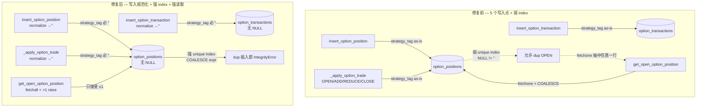
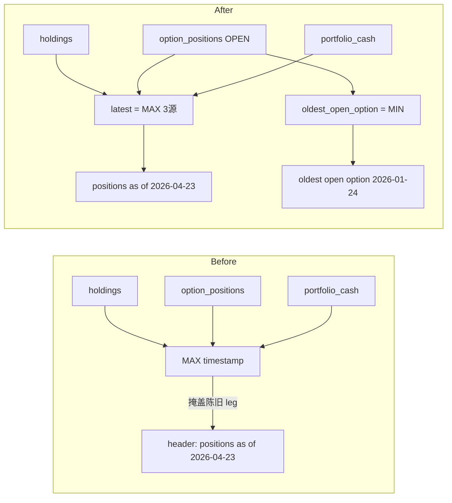
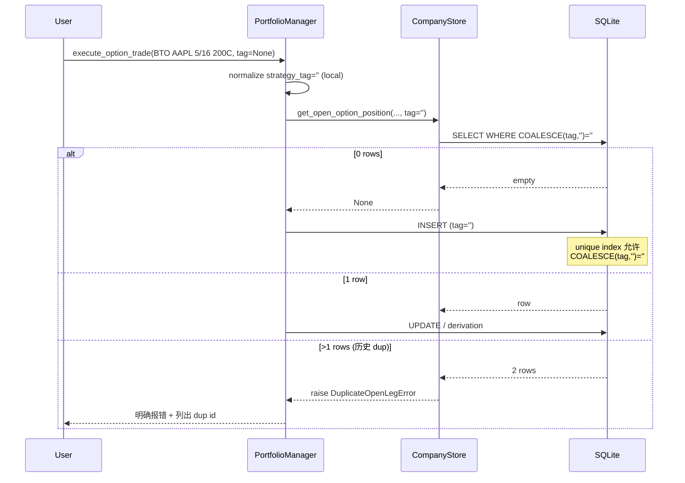
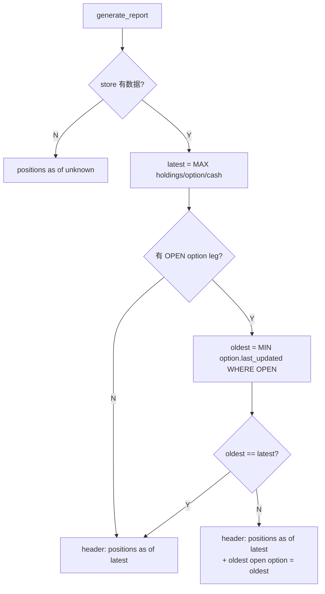

# Option Lifecycle Code-Review Follow-up (P1 + P2)

**日期**: 2026-04-24
**Branch**: `feature/trade-option-lifecycle` (worktree: `.worktrees/option-lifecycle`)
**上下文**: atomic option trade engine（commits `794f458..570189a`）review 结果两个遗留问题。
**北极星对齐**: Portfolio Desk 持仓层 — 此 follow-up 在"持仓原子写入"与"PI 可见性"子层面上收紧约束，不引入新层。

---

## 问题总结

### P1 — 重复 OPEN leg 的静默返回（严重 / defensive bug）

**文件**: `terminal/company_store.py:968-985`

`get_open_option_position()` 用 `fetchone()` + `COALESCE(strategy_tag, '') = ?` 匹配。当遇到：
- 历史 DB 里有重复 OPEN leg（同 5-tuple identity）
- 或一行 `strategy_tag = NULL`、另一行 `strategy_tag = ''`

会静默返回任意一行。lifecycle engine 拿到任意一行后继续 close / update，只动到其中一个 stale leg，另一个变孤儿 OPEN。

**现有护栏的漏洞**：
- Migration 7（`terminal/company_store.py:379-404`）已经有 dup 检测，但：
  - 检测用的是**原始** `strategy_tag`（`GROUP BY ... strategy_tag`）——NULL 与 '' 被视为不同组，不会合并成 "dup"
  - 发现 dup 时**只 log，跳过 index 创建**——index 没建，lifecycle engine 继续跑，依然会踩坑
- Schema CREATE（`:200-202`）与 Migration 7（`:400-403`）都用原始 `strategy_tag` 建 unique index。SQLite 对 NULL 视为 distinct，所以 `(AAPL, ..., NULL)` × N 可合法共存；index 形同虚设。
- `insert_option_position()`、`_apply_option_trade_in_transaction()`（`portfolio/holdings/manager.py:471-479`）、`insert_option_transaction()` 写入时都没规范化 `strategy_tag`。如果 caller 传 `None`，会写入 NULL。

### P2 — `positions as of` 掩盖陈旧 OPEN leg（可见性 bug）

**文件**: `scripts/portfolio_intelligence.py:236-271`

`get_positions_as_of()` 返回 `MAX(last_updated)` across holdings / option_positions / portfolio_cash 三源。Cash 写入频繁（每笔交易都触发），option leg 写入稀疏（只在开/平仓时动）。

**场景**：3 个月前开 AAPL put leg（`last_updated=2026-01-24`）忘了关；昨天发工资 cash 写入 `updated_at=2026-04-23`。

**结果**：header 显示 `positions as of 2026-04-23`——陈旧 leg 完全隐形。这次改动的目标本来就是让 OPEN leg 的陈旧度可见，但 header 里恰好被抹掉了。

---

## 架构图

### P1 数据流（修复前 vs 后）

### P2 数据流（修复前 vs 后）

---

## 业务流程图

### P1 — 插入一笔 BTO 时的约束链

### P2 — PI 报告 header 渲染

---

## 替代方案对比

### P1 方案对比

| 方案 | 优点 | 缺点 | 采纳 |
|------|------|------|------|
| A. 只改读取（fetchall + raise），不动 schema | 最小侵入 | 写入仍能产生 dup + NULL；只是让下次读取炸；没根治 | ❌ |
| B. 写入规范化 + 强 index（COALESCE expr） + 读取 raise + migration 规范化 | 三道防线，从源头切断 NULL / dup | 改动面大，migration 对历史 DB 操作 | ✅ |
| C. 加 CHECK(strategy_tag IS NOT NULL) | 最硬保证 | SQLite CHECK 修改需表重建，风险高；对既有 DB 迁移复杂 | ❌ |

**采 B**。三层防护：
1. 写入路径 `_normalize_strategy_tag(tag) -> str` helper，所有 insert 走它
2. DB 层 unique index 用 `COALESCE(strategy_tag, '')` 表达式（SQLite ≥3.9 支持）
3. 读取层 `get_open_option_position()` 用 `fetchall()`，>1 抛 `DuplicateOpenOptionLegError`

### P2 方案对比

| 方案 | 优点 | 缺点 | 采纳 |
|------|------|------|------|
| A. 改 MAX 为按"是否含 option"加权 | header 单行不变 | 语义不明；Boss 看报告更难理解 | ❌ |
| B. 返回 dict `{latest, oldest_open_option}`，header 两行 | 语义清晰；陈旧 leg 一眼可见 | header 多一行（仅有 open option 时） | ✅ |
| C. 从 MAX 里剔除 cash | 保持单行 | 语义变形；cash 写入也是合法 position-book 变动 | ❌ |

**采 B**。`latest` 语义不变（最新一次 position-book 写入），新增 `oldest_open_option` 显式暴露最陈旧的 OPEN leg。只在 `oldest != latest` 且有 OPEN option 时加第二段，不扰乱无期权场景。

---

## 风险自证

**最大风险：migration 对生产 company.db（已 push 到云端）造成破坏。**

生产 DB 当前状态（worktree 实测）：无 OPEN option 行 → 无 NULL strategy_tag → 无 dup → migration 是 no-op。即便如此仍做防御：
- Migration 分两步：(a) `UPDATE SET strategy_tag = ''` 是幂等 + 无副作用的；(b) dup 检测用 COALESCE 表达式 GROUP，若发现 dup **raise RuntimeError 中止**（比现在的 log+skip 严格），让 Boss 手动 reconcile，避免静默跑过一个假装修好的 DB
- 建 unique index 前调用 dup 检测；失败则不建 index（已有行为）
- Migration 可回滚：drop 新 index、drop 新 CHECK 后回到原状态，不破坏既有列

**次要风险：COALESCE expression index 的 SQLite 版本兼容性。**
要求 ≥3.9（2015 年发布），云端 Python 3.10 + 本地 Python 3.12+ 的 sqlite3 均远超此版本。无需兼容测试。

**为什么不选更简单的做法**：
- 只改读取层（方案 A）= 把问题推给未来的写入方；仍会在 DB 里累积脏数据
- 不修 schema = NULL 与 '' 仍能作为两个 OPEN leg 共存，unique index 形同虚设

---

## 验收标准

### P1
- [ ] 新 DB：`strategy_tag` 列 default '' 保持不变；建 `idx_option_pos_open_contract` 用 `COALESCE(strategy_tag, '')` 表达式
- [ ] `insert_option_position()` / `_apply_option_trade_in_transaction()` / `insert_option_transaction()` 若 caller 传 `None`，写入时转 ''
- [ ] `get_open_option_position()`：0 行 → None；1 行 → dict；≥2 行 → raise `DuplicateOpenOptionLegError` 带 id 列表
- [ ] Migration 8 (新)：
  - `UPDATE option_positions SET strategy_tag = '' WHERE strategy_tag IS NULL`
  - `UPDATE option_transactions SET strategy_tag = '' WHERE strategy_tag IS NULL`
  - dup 检测用 COALESCE GROUP；若 >0 组 → raise 带详细信息
- [ ] 既有 `idx_option_pos_open_contract`（raw strategy_tag）若存在先 DROP，再重建为 COALESCE 表达式版本
- [ ] 历史 DB 做 dry-run migration：worktree 自带的 `data/company.db` 开得起，无 error

### P2
- [ ] `get_positions_as_of(store)` → dict：`{"latest": str|None, "oldest_open_option": str|None}`
- [ ] Header 渲染：
  - 无任何 position → `positions as of unknown`（原行为）
  - 有 position 但无 OPEN option，或 oldest == latest → 单段：`positions as of YYYY-MM-DD`
  - 有 OPEN option 且 oldest != latest → 双段：`positions as of YYYY-MM-DD | oldest open option YYYY-MM-DD`
- [ ] 现有 3 条 TestPositionsAsOf 测试适配新返回类型

### 全局
- [ ] 1680 pass 不退步
- [ ] `git diff --check` 通过
- [ ] worktree 自带 `data/company.db` 打开一次、验证 migration idempotent

---

## Checklist

### Phase 1 — 写 plan（本文件）
- [x] 写初稿
- [x] Boss 审批

### Phase 2 — P1 实现（`terminal/company_store.py`）
- [x] 顶层加 `DuplicateOpenOptionLegError(RuntimeError)` 类
- [x] 模块级 helper `_normalize_strategy_tag(tag: str | None) -> str`
- [x] `insert_option_position()`：接收处 normalize
- [x] `insert_option_transaction()`：接收处 normalize
- [x] `get_open_option_position()`：`fetchall()`；0→None；1→dict；>1→raise
- [x] Schema `_SCHEMA`：unique index 从此处**移除**，挪到 migration 8（见下方执行发现）
- [x] 新 Migration 8（在既有 7 之后）：
  - COALESCE GROUP 做 dup 检测（带 GROUP_CONCAT(ids)）；>0 抛 DuplicateOpenOptionLegError
  - DROP legacy raw-strategy_tag index
  - 两表 NULL→'' update
  - CREATE `idx_option_pos_open_contract` 用 COALESCE 表达式
- [x] `portfolio/holdings/manager.py:_apply_option_trade_in_transaction`：入口 normalize（直接 INSERT 路径兜底）

### Phase 3 — P2 实现（`scripts/portfolio_intelligence.py`）
- [x] `get_positions_as_of(store)` 签名改返回 `{"latest", "oldest_open_option"}` dict
- [x] 添加 `oldest_open_option` SQL：`SELECT MIN(last_updated) FROM option_positions WHERE status='OPEN'`
- [x] `generate_report()` 的 header 构造改用新返回结构；仅在 `oldest != latest` 时加 `| oldest open option YYYY-MM-DD`
- [x] 其他 snapshot 字段不变

### Phase 4 — 测试
- [x] `tests/test_portfolio_store.py`：新增 9 条测试
  - insert 传 `None` → DB 读回 ''（positions + transactions 各一）
  - dup OPEN leg → `get_open_option_position` raise + 错误带 ids
  - NULL + '' 混合 → lookup 也 raise
  - Migration 8: 单独 NULL → 规范化
  - Migration 8: COALESCE 下的 dup → raise
  - Migration 8: **legacy raw-index + (NULL, '') → 仍走 DuplicateOpenOptionLegError 而非 IntegrityError**（review 后补）
  - Migration idempotent
- [x] `tests/test_portfolio/test_intelligence.py`:
  - `TestPositionsAsOf` 3 条改为验证 dict 返回
  - 新测：陈旧 option + 新 cash → `{latest:'2026-04-23', oldest_open_option:'2026-01-24'}`

### Phase 5 — 验证
- [x] `pytest` 全量：1689 pass + 3 skip（从 1680 + 9 新测试 = 1689）
- [x] 仅既有 `rs_rating.py` RuntimeWarning，无新警告
- [x] worktree 自带 `data/company.db` 打开后：NULL strategy_tag 两表 = 0，OPEN 行 = 0，index 已为 COALESCE 表达式版
- [x] `git diff --check` 通过
- [x] 暂不 commit；提交前跟 Boss 确认云端部署步骤

### Phase 6 — 部署准备（Boss 审批后）
- [ ] Commit：一个 commit 含 P1 + P2 + plan 文档（历史记录）
- [ ] 云端部署步骤：
  - 代码通过 06:25 auto-pull 到云端
  - 云端下次 `get_store()` 触发 migration 8
  - 验证：`ssh aliyun "sqlite3 /root/workspace/Finance/data/company.db 'SELECT COUNT(*) FROM option_positions WHERE strategy_tag IS NULL'"` → 0
  - 验证 index：`ssh aliyun "sqlite3 /root/workspace/Finance/data/company.db \".schema option_positions\""` 应含 COALESCE 表达式

---

## 执行发现（Plan 之外）

### Finding 1 — SCHEMA 里的 UNIQUE INDEX 必须移除

**症状**：第一次实现时，`_SCHEMA` 里保留 `CREATE UNIQUE INDEX ... COALESCE(...)`，legacy 测试用 dup fixture 打开 DB 立刻 `sqlite3.IntegrityError`，migration 8 来不及做 dup 检测。

**根因**：`_init_db()` 先 `executescript(_SCHEMA)` 再 `_migrate_if_needed()`。`CREATE UNIQUE INDEX IF NOT EXISTS` 遇到表里已有 dup 行会 IntegrityError，失败点在 schema，不是 migration。

**修正**：unique index 从 `_SCHEMA` 删除，只在 migration 8 中创建。fresh DB 走 migration 8 创建 index；legacy DB 走 migration 8 先检测 dup 再重建 index。

### Finding 2 — Migration 8 步骤顺序必须是"检测 → DROP → UPDATE → CREATE"（review 后）

**症状**：Boss review 指出 legacy DB 可能保留旧的 raw `idx_option_pos_open_contract`（非 COALESCE）。此时 `(contract, NULL)` + `(contract, '')` 在旧 index 下合法共存。若先 `UPDATE NULL → ''`，旧 index 立即检测到新 dup → `sqlite3.IntegrityError`，操作员拿不到 DuplicateOpenOptionLegError 的 id 列表。

**修正**：顺序改为
1. COALESCE GROUP 做 dup 检测（+ GROUP_CONCAT(ids) 便于人工 reconcile）
2. DROP legacy index
3. UPDATE NULL → ''
4. CREATE 新 COALESCE index

并补测 `test_migration_raises_cleanly_on_legacy_raw_index_with_null_plus_empty`：fixture 重建旧 raw index + seed (NULL,'') 对 → 验证 raise 的是 `DuplicateOpenOptionLegError` 而非 `sqlite3.IntegrityError`。

---

## 北极星对齐

此 plan 在 Portfolio Desk（北极星 "持仓与风控层"）的 "原子持仓写入" 与 "PI 可见性" 两个子能力上加防御。不新增层，不改接口契约。
